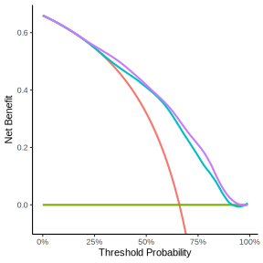

```{r eval=FALSE, message=FALSE, warning=FALSE, include=FALSE}
library(tidyverse)
library(rms)
library(gtsummary)
library(dcurves)
library(gt)


# Load data
options(prType='html')
Hmisc::getHdata(acath)

# drop those without cholesterol and setup sex variable
acath <- subset(acath, !is.na(choleste))

# pre model (age and sex)
pre <- lrm(sigdz ~ rcs(age,4) * sex, data = acath)
pre_pred <- predict(pre, type='fitted')

# post model (age, sex and cholesterol)
post <- lrm(sigdz ~ rcs(age,4) * sex + rcs(choleste,4) + rcs(age,4) %ia%
              rcs(choleste,4), data = acath)
post_pred <- predict(post, type='fitted')

# combine predictions with original data
acath_pred <-
  bind_cols(
    acath,
    pre_pred %>% enframe(name = NULL, value = "pre"),
    post_pred %>% enframe(name = NULL, value = "post")
  )

# decision curve
dca_prepost <-
  dca(
    sigdz ~ pre + post,
    data = acath_pred,
    label = list(pre = "Age and Sex", 
                 post = "Age, Sex and Cholesterol"), 
  )

dca_prepost_smooth <-
  dca_prepost %>%
  plot(smooth = TRUE)

dca_prepost_15_35 <-
  dcurves::dca(
    sigdz ~ pre + post,
    data = acath_pred,
    thresholds = seq(0.15, 0.35, by = 0.05),
    label = list(pre = "Age and Sex", post = "Age, Sex and Cholesterol"),
    # show_ggplot_code = TRUE
  ) %>%
  plot(type = 'net_benefit', 
       smooth = FALSE, 
       show_ggplot_code = FALSE)

# net interventions avoided
dca_prepost_netint_ob <- dca_prepost %>%
  dcurves::net_intervention_avoided() 

dca_prepost_netint <- dca_prepost_netint_ob %>% 
  plot(x, 
       type = 'net_intervention_avoided', 
       smooth = FALSE, 
       show_ggplot_code = FALSE)

# estimates table
df_dca_tbl <-
  dca_prepost_netint_ob$dca %>%
  filter(variable %in% c("pre", "post")) %>%
  # keep 5-50%, by 5%
  transmute(
    threshold100 = threshold*100,
    groupvar = factor(variable, levels = c("pre", "post")),
    net_benefit, net_intervention_avoided
  ) %>%
  filter(threshold100 > 1 & threshold100 <= 50 & round(threshold100 %% 5) == 0) %>%
  mutate(threshold100 = factor(str_glue("{threshold100}%"),
                               levels = c("5%", "10%", "15%", "20%", "25%",
                                          "30%", "35%", "40%", "45%", "50%")))

# create gtsummary table to start so gtsummary themes can be used
dca_tbl_continuous <-
  tbl_continuous(
    data = df_dca_tbl,
    variable = net_benefit,
    include = threshold100,
    by = groupvar,
    statistic = list(everything() ~ "{median}"),
    digits = list(everything() ~ 4)
  ) %>%
  modify_footnote(everything() ~ NA) %>%
  modify_header(update = list(
    label ~ "**Threshold**",
    stat_1 ~ "**Net Benefit (Age+Sex)**",
    stat_2 ~ "**Net Benefit (Age+Sex+Cholesterol)**"
  ))

df_diff_tbl <-
  df_dca_tbl %>%
  # First, reshape two columns to long
  pivot_longer(
    cols = c(starts_with("net_"))
  ) %>%
  # Create name variable
  unite(name, c(groupvar, name), sep = "_") %>%
  # Reshape to wide to get difference
  pivot_wider(
    names_from = "name",
    values_from = "value"
  ) %>%
  # Calculate differences
  transmute(
    threshold100,
    diff_net_benefit = post_net_benefit - pre_net_benefit,
    diff_net_intavoid = post_net_intervention_avoided - pre_net_intervention_avoided
  )

# Merge in with continuous table
estimate_tbl <-
  dca_tbl_continuous %>%
  modify_table_body(
    ~ .x %>%
      left_join(
        df_diff_tbl,
        by = c("label" = "threshold100")
      ) %>%
      filter(row_type != "label")
  ) %>%
  modify_header(
    diff_net_benefit = "**Difference in Net Benefit**",
    diff_net_intavoid = "**Net Difference in Interventions Avoided per 100 patients**"
  ) %>%
  modify_fmt_fun(c(diff_net_benefit, diff_net_intavoid) ~ function(x) { style_sigfig(x, digits = 4)})


performance_data_dc <- rtichoke::prepare_performance_data(
  probs = list("Age and Sex" = acath_pred$pre,
               "Age, Sex and Cholesterol" = acath_pred$post),
  reals = list(acath_pred$sigdz)
) 


conventional_dc <- performance_data_dc %>% 
  rtichoke::plot_decision_curve(
    col_values = c("#00BFC4", "#C77CFF"),
    size = 400
  ) %>% 
  plotly::layout(
    yaxis = list(range =
                   c(-0.07, 0.7))
  )

```

```{r xaringan-panelset, echo=FALSE}
xaringanExtra::use_panelset()
xaringanExtra::style_panelset_tabs(font_family = "inherit")
```

## Additional Benefit of a New Marker

Prediction Model might gain accuracy if you'll add more relevant features to existing models, but many times it's not obvious what is the additional value of additional feature and how to quantify it in terms of Decision Making. The post [Decision curve analysis for quantifying the additional benefit of a new marker](https://www.fharrell.com/post/addmarkerdca) by Emily Vertosick and Andrew Vickers show a simple example (the code presented here is almost identical to the original code presented in the link).

## Preparing the Data

### Loading the Data with Hmisc

```{r message=FALSE, warning=FALSE}
library(Hmisc)
library(dplyr)
library(tibble)

getHdata(acath)
acath <- subset(acath, !is.na(choleste))

```

### Fitting Logistic Regressions with rms

```{r message=FALSE, warning=FALSE}
library(rms)

pre <- lrm(sigdz ~ rcs(age,4) * sex, data = acath)
pre_pred <- predict(pre, type='fitted')

post <- lrm(sigdz ~ rcs(age,4) * sex + rcs(choleste,4) + rcs(age,4) %ia% rcs(choleste,4), data = acath)
post_pred <- predict(post, type='fitted')

acath_pred <- bind_cols(
    acath,
    pre_pred %>% enframe(name = NULL, value = "pre"),
    post_pred %>% enframe(name = NULL, value = "post")
  )

```

## Conventional Decision Curve

::: panelset
::: panel
    <div class="panel-name">original code with dcurves</div>

```{r eval=FALSE, message=FALSE, warning=FALSE}
library(dcurves)

dca_prepost <- dca(
    sigdz ~ pre + post,
    data = acath_pred,
    label = list(pre = "Age and Sex", 
                 post = "Age, Sex and Cholesterol"))

dca_prepost %>%
  plot(smooth = TRUE)  + 
  theme_classic()  +
  theme(legend.position = "none")

```



```{r eval=FALSE, include=FALSE}

# 
# dca_prepost_smooth_plot <- dca_prepost_smooth + 
#   theme_classic() +
#   theme(legend.position = "none") +
#   ggplot2::theme(
#     rect = ggplot2::element_rect(fill = "transparent"),
#     panel.background = ggplot2::element_rect(fill='transparent'), #transparent panel bg
#     plot.background = ggplot2::element_rect(fill='transparent', color=NA), #transparent plot bg
#     panel.grid.major = ggplot2::element_blank(), #remove major gridlines
#     panel.grid.minor = ggplot2::element_blank(), #remove minor gridlines
#     legend.background = ggplot2::element_rect(fill='transparent'), #transparent legend bg
#     legend.box.background = ggplot2::element_rect(fill='transparent') #transparent legend panel
#   ) 

# 
# ggsave("./content/blog/2022-07-05-dca-for-quantifying-the-additional-benefit-of-a-new-marker-by-emily-vertosick-and-andrew-vickers/conventional_decision.svg",
#        bg='transparent',
#        units = "px")

```
:::

::: panel
    <div class="panel-name">rtichoke code</div>

```{r eval=FALSE, message=FALSE, warning=FALSE}
library(rtichoke)
library(plotly)

performance_data_dc <- prepare_performance_data(
  probs = list(
    "Age and Sex" = acath_pred$pre,
    "Age, Sex and Cholesterol" = acath_pred$post
  ),
  reals = list(acath_pred$sigdz)
)

performance_data_dc %>%
  plot_decision_curve(
    col_values = c("#00BFC4", "#C77CFF"),
    size = 400
  ) %>%
  layout(
    yaxis = list(
      range =
        c(-0.07, 0.7)
    )
  )

```

```{r echo=FALSE, message=FALSE, warning=FALSE}

library(rtichoke)
library(plotly)

performance_data_dc <- rtichoke::prepare_performance_data(
  probs = list("Age and Sex" = acath_pred$pre,
               "Age, Sex and Cholesterol" = acath_pred$post),
  reals = list(acath_pred$sigdz)
) 

conventional_dc <- performance_data_dc %>% 
  rtichoke::plot_decision_curve(
    col_values = c("#00BFC4", "#C77CFF"),
    size = 400
  ) %>% 
  layout(
    yaxis = list(range =
                   c(-0.07, 0.7))
  )

conventional_dc %>% 
  plotly::layout(plot_bgcolor = "#fff7f5", 
                paper_bgcolor= "#fff7f5")
```
:::
:::

## Specific Range of Probability Thresholds


### original code

```{r message=FALSE, warning=FALSE, eval=FALSE}
library(dcurves)

dca_prepost_15_35 <- dca(
    sigdz ~ pre + post,
    data = acath_pred,
    thresholds = seq(0.15, 0.35, by = 0.05),
    label = list(pre = "Age and Sex", 
                 post = "Age, Sex and Cholesterol")) %>%
  plot(type = 'net_benefit', 
       smooth = FALSE, 
       show_ggplot_code = FALSE)

dca_prepost_15_35 + 
  theme_classic()  + 
  theme(legend.position = "none")

```


```{r eval=FALSE, include=FALSE}


# dca_prepost_15_35_smooth_plot <- dca_prepost_15_35 +
#   theme_classic() +
#   theme(legend.position = "none") +
#   ggplot2::theme(
#     rect = ggplot2::element_rect(fill = "transparent"),
#     panel.background = ggplot2::element_rect(fill='transparent'), #transparent panel bg
#     plot.background = ggplot2::element_rect(fill='transparent', color=NA), #transparent plot bg
#     panel.grid.major = ggplot2::element_blank(), #remove major gridlines
#     panel.grid.minor = ggplot2::element_blank(), #remove minor gridlines
#     legend.background = ggplot2::element_rect(fill='transparent'), #transparent legend bg
#     legend.box.background = ggplot2::element_rect(fill='transparent') #transparent legend panel
#   )


# ggsave("./content/blog/2022-07-05-dca-for-quantifying-the-additional-benefit-of-a-new-marker-by-emily-vertosick-and-andrew-vickers/conventional_decision_15_35.svg",
#        bg='transparent',
#        height = 1200, 
#        width = 1200,
#        units = "px")

```


### rtichoke code

```{r message=FALSE, warning=FALSE, eval=FALSE}

performance_data_dc %>% 
  rtichoke::plot_decision_curve(
    col_values = c("#00BFC4", "#C77CFF"),
    min_p_threshold = 0.15, 
    max_p_threshold = 0.35,
    size = 400
  ) %>% 
  plotly::layout(
    yaxis = list(range =
                   c(-0.07, 0.7))
  ) 
```

```{r echo=FALSE, message=FALSE, warning=FALSE}

performance_data_dc %>% 
  rtichoke::plot_decision_curve(
    col_values = c("#00BFC4", "#C77CFF"),
    min_p_threshold = 0.15, 
    max_p_threshold = 0.35,
    size = 400
  ) %>% 
  plotly::layout(
    yaxis = list(range =
                   c(-0.07, 0.7))
  ) %>% 
  plotly::layout(plot_bgcolor = "#fff7f5", 
                paper_bgcolor= "#fff7f5")
```


## Interventions Avoided

<div class="panelset">

  <div class="panel">

    <div class="panel-name">original code</div>


<!-- ```{r eval=FALSE, include=FALSE} -->

<!-- dca_prepost_netintplot <- dca_prepost_netint +  -->

<!--   theme_classic()  +  -->

<!--   theme(legend.position = "none") + -->

<!--   ggplot2::theme( -->

<!--     rect = ggplot2::element_rect(fill = "transparent"), -->

<!--     panel.background = ggplot2::element_rect(fill='transparent'), #transparent panel bg -->

<!--     plot.background = ggplot2::element_rect(fill='transparent', color=NA), #transparent plot bg -->

<!--     legend.background = ggplot2::element_rect(fill='transparent'), #transparent legend bg -->

<!--     legend.box.background = ggplot2::element_rect(fill='transparent') #transparent legend panel -->

<!--   )  -->

<!-- # ggsave("./content/blog/2022-07-05-dca-for-quantifying-the-additional-benefit-of-a-new-marker-by-emily-vertosick-and-andrew-vickers/interventions_avoided.svg", -->

<!-- #        bg='transparent', -->

<!-- #        units = "px") -->

<!-- ``` -->


### rtichoke code

  </div>

  <div class="panel">

    <div class="panel-name">rtichoke code</div>

```{r message=FALSE, warning=FALSE, eval=FALSE}

performance_data_dc %>%
  rtichoke::plot_decision_curve(
    col_values = c("#F8766D", "#00BFC4"),
    type = "interventions avoided",
    size = 400
  ) %>%
  plotly::layout(
    yaxis = list(range =
                   c(-10, 100))
  )

```

```{r echo=FALSE, message=FALSE, warning=FALSE}

performance_data_dc %>%  
  rtichoke::plot_decision_curve( 
    col_values = c("#F8766D", "#00BFC4"), 
    type = "interventions avoided",
    size = 400
  ) %>%  
  plotly::layout(
    yaxis = list(range = 
                   c(-10, 100)) 
  ) %>% 
plotly::layout(plot_bgcolor = "#fff7f5", 
               paper_bgcolor= "#fff7f5") 
``` 


  </div>

</div>

### Conventional and Interventions Avoided Combined (rtichoke code)

```{r message=FALSE, warning=FALSE, eval=FALSE}

performance_data_dc %>%

  rtichoke::plot_decision_curve(

    col_values = c("#00BFC4", "#C77CFF"),

    type = "combined",

    size = 400

  )

```

```{r echo=FALSE, message=FALSE, warning=FALSE}

performance_data_dc %>%

  rtichoke::plot_decision_curve(

    col_values = c("#00BFC4", "#C77CFF"),

    type = "combined",

    size = 400

  ) %>%

plotly::layout(plot_bgcolor = "#fff7f5",

               paper_bgcolor= "#fff7f5")

```
