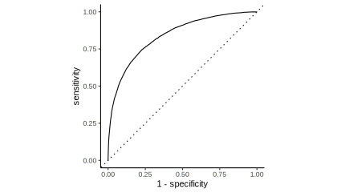
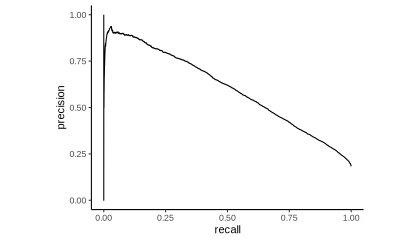

```{r xaringan-panelset, echo=FALSE}
xaringanExtra::use_panelset()
```

## Precision Recall and ROC

Precision Recall Curve is shown as an alternative to the known ROC curve in the ["second part from the 'Measuring Performance' Chapter of Feature Engineering and Selection"](http://www.feat.engineering/measuring-performance.html#class-metrics). It is mentioned that this curve is more appropriate in terms of [Information Retrieval](https://nlp.stanford.edu/IR-book/information-retrieval-book.html).

## Original Code

The code is almost identical to the original code that can be found [on github](https://github.com/topepo/FES/blob/master/03_A_Review_of_the_Predictive_Modeling_Process/03_02_02_Classification_Metric.R).

### Download caret object from github

`okc_glm_tkeyword.RData` was created by the `caret::train()` function, you can reproduce it by using the code on [github](https://github.com/topepo/FES/blob/06812c48a21882808403cee338b8312fdbd35a46/05_Encoding_Categorical_Predictors/05_06_Creating_Features_from_Text_Data/modeling.R#L235).

Alternatively you can download the caret object [from here](https://github.com/topepo/FES/blob/master/05_Encoding_Categorical_Predictors/05_06_Creating_Features_from_Text_Data/okc_glm_keyword.RData?raw) and load it into the global environment by running the following command:

```{r eval=FALSE, message=FALSE, warning=FALSE}

load("okc_glm_keyword.RData")

```

### Creating Performance Metrics Curves with yardstick

<div class="panelset">
  <div class="panel">    
    <div class="panel-name">ROC</div>

```{r message=FALSE, warning=FALSE, eval=FALSE}
library(yardstick)
library(ggplot2)
library(magrittr)

glm_keyword$pred  %>% 
  roc_curve(obs, stem) %>% 
  autoplot()  +
  theme_classic()

```

```{r eval=FALSE, include=FALSE}

# roc_yardstick <- glm_keyword$pred  %>%
#   roc_curve(obs, stem) %>%
#   autoplot() + 
#   theme_classic() +
# theme(
#   rect = ggplot2::element_rect(fill = "transparent"),
#       panel.background = ggplot2::element_rect(fill='transparent'), #transparent panel bg
#     plot.background = ggplot2::element_rect(fill='transparent', color=NA), #transparent plot bg
#     panel.grid.major = ggplot2::element_blank(), #remove major gridlines
#     panel.grid.minor = ggplot2::element_blank(), #remove minor gridlines
#     legend.background = ggplot2::element_rect(fill='transparent'), #transparent legend bg
#     legend.box.background = ggplot2::element_rect(fill='transparent') #transparent legend panel
# )

# ggsave("./content/blog/2022-08-01-precision-recall/roc-yardstick.svg",
#        bg='transparent',
#        units = "px")

```



  </div>

  <div class="panel">
    <div class="panel-name">Precision Recall</div>

```{r message=FALSE, warning=FALSE, eval=FALSE}
library(yardstick)
library(ggplot2)
library(magrittr)

glm_keyword$pred  %>% 
  pr_curve(obs, stem) %>% 
  autoplot()  +
  theme_classic()

```

```{r eval=FALSE, include=FALSE}

# precision_recall_yardstick <- glm_keyword$pred  %>%
#   pr_curve(obs, stem) %>%
#   autoplot() + 
#   theme_classic() +
# theme(
#   rect = ggplot2::element_rect(fill = "transparent"),
#       panel.background = ggplot2::element_rect(fill='transparent'), #transparent panel bg
#     plot.background = ggplot2::element_rect(fill='transparent', color=NA), #transparent plot bg
#     panel.grid.major = ggplot2::element_blank(), #remove major gridlines
#     panel.grid.minor = ggplot2::element_blank(), #remove minor gridlines
#     legend.background = ggplot2::element_rect(fill='transparent'), #transparent legend bg
#     legend.box.background = ggplot2::element_rect(fill='transparent') #transparent legend panel
# )

# ggsave("./content/blog/2022-08-01-precision-recall/precision-recall-yardstick.svg",
#        bg='transparent',
#        units = "px")

```




  </div>
</div>

## rtichoke code

### Creating Performance Metrics Curves with rtichoke  {.panelset}

#### ROC

```{r message=FALSE, warning=FALSE, eval=FALSE}
library(rtichoke)

create_roc_curve(
  probs = list(glm_keyword$pred$stem),
  reals = list(glm_keyword$pred$obs == "stem"),
  size = 400
)
```

```{r echo=FALSE}

library(rtichoke)
library(magrittr)

# glm_keyword_pred <- glm_keyword$pred
# save(glm_keyword_pred, 
#      file = "./content/blog/2022-08-01-precision-recall/glm_keyword_pred.RData")

load("./glm_keyword_pred.RData")


create_roc_curve(
  probs = list(glm_keyword_pred$stem),
  reals = list(glm_keyword_pred$obs == "stem"),
  size = 400
) %>% 
plotly::layout(plot_bgcolor = "#fff7f5", 
               paper_bgcolor= "#fff7f5")

```

#### Precision Recall

```{r message=FALSE, warning=FALSE, eval=FALSE}
library(rtichoke)

create_precision_recall_curve(
  probs = list(glm_keyword$pred$stem),
  reals = list(glm_keyword$pred$obs == "stem"),
  size = 400
)
```

```{r echo=FALSE, message=FALSE, warning=FALSE}
library(rtichoke)


create_precision_recall_curve(
  probs = list(glm_keyword_pred$stem),
  reals = list(glm_keyword_pred$obs == "stem"),
  size = 400
) %>% 
plotly::layout(plot_bgcolor = "#fff7f5", 
               paper_bgcolor= "#fff7f5")


```


